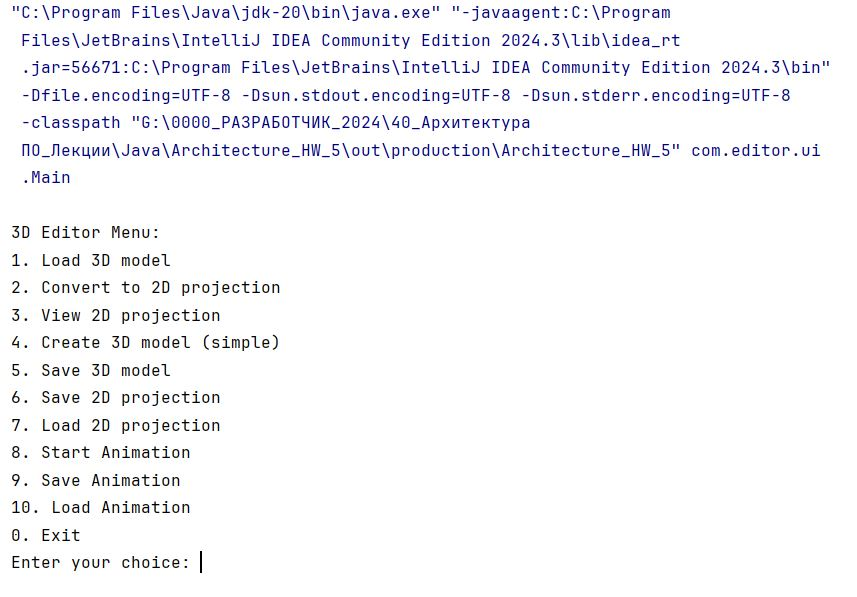

# Архитектура ПО 

## Урок 5. Горизонтальные уровни и вертикальные срезы архитектуры

**Задание 1**. Сформировать компоненты для любой системы из задания. 
Выпустить диаграмму компонент UML (сдача в формате jpg файла на GitHub)

**Задание 2**. (со звездочкой) Сделать реализацию на языке JAVA

## РЕШЕНИЕ:

1. UML-диаграмма 3D-редактора:

2. Реализация проекта на JAVA:

[Реализация кода](src/com/editor)

3. Скриншот выполнения кода:

   
   
   
